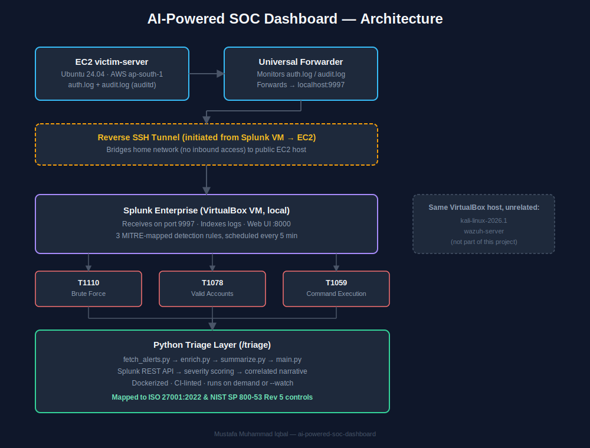

<div align="center">

# 🛡️ AI-Powered SOC Dashboard

**A hands-on SIEM + threat detection lab connecting GRC/compliance knowledge with practical security engineering**

[](https://github.com/Mustafa-Hazard/ai-powered-soc-dashboard/actions/workflows/ci.yml)


[Portfolio](https://mustafa-cyberhub.vercel.app/) · [Report an Issue](https://github.com/Mustafa-Hazard/ai-powered-soc-dashboard/issues) · [Author](#author)

</div>

---

## Overview

A full-stack detection engineering lab built from the ground up: a real attack target on
AWS, a Splunk Enterprise SIEM pipeline, MITRE ATT&CK-mapped detection rules validated
against genuine simulated attacks, and a Python automation layer that triages, scores,
and summarizes alerts — with every detection explicitly mapped back to real ISO 27001
and NIST 800-53 compliance controls.

Most portfolio projects demonstrate either compliance knowledge **or** engineering
skill. This one connects both.

## Table of Contents

- [Architecture](#architecture)
- [MITRE ATT&CK Coverage](#mitre-attck-coverage)
- [Compliance Mapping](#compliance-mapping)
- [Tech Stack](#tech-stack)
- [Repository Structure](#repository-structure)
- [Quick Start — Python Triage Layer](#quick-start--python-triage-layer)
- [Sample Output](#sample-output)
- [Detection Logic](#detection-logic)
- [Documentation](#documentation)
- [Known Limitations](#known-limitations)
- [Roadmap](#roadmap)
- [Author](#author)

## Architecture



| Layer | Component | Role |
|---|---|---|
| 1 | AWS EC2 (Ubuntu 24.04) | Real attack target — generates `auth.log` (SSH) and `audit.log` (auditd/execve) |
| 2 | Splunk Universal Forwarder | Ships logs from EC2 to Splunk via a reverse SSH tunnel |
| 3 | Splunk Enterprise (VirtualBox VM) | Indexes logs, runs scheduled correlation searches |
| 4 | Detection Rules (SPL) | Three MITRE ATT&CK-mapped alerts, scheduled every 5 min |
| 5 | Python Triage Layer | Fetches alerts via REST API → scores → correlates → summarizes |

**Why a reverse SSH tunnel?** The Splunk VM runs on a home network unreachable from the
public internet. Rather than exposing that network, the Splunk VM initiates an outbound
connection to EC2 and asks it to forward traffic back — EC2 stays the only exposed
surface. Full write-up: [`docs/phase-2-splunk-setup.md`](./docs/phase-2-splunk-setup.md).

## MITRE ATT&CK Coverage

| Technique | Name | Category | Status |
|---|---|---|---|
| [T1110](https://attack.mitre.org/techniques/T1110/) | Brute Force | Credential Access | ✅ |
| [T1078](https://attack.mitre.org/techniques/T1078/) | Valid Accounts | Defense Evasion / Persistence | ✅ |
| [T1059](https://attack.mitre.org/techniques/T1059/) | Command and Scripting Interpreter | Execution | ✅ |

Full SPL queries and detection logic: [`docs/phase-4-detection-engineering.md`](./docs/phase-4-detection-engineering.md).

## Compliance Mapping

Every detection is tied to a real, verified control — not just technically justified,
but compliance-justified.

| Technique | ISO 27001:2022 | NIST SP 800-53 Rev 5 |
|---|---|---|
| T1110 | A.8.5 — Secure authentication | AC-7 — Unsuccessful Logon Attempts |
| T1078 | A.8.2 — Privileged access rights | AC-2 — Account Management |
| T1059 | A.8.16 — Monitoring activities | AU-6 — Audit Record Review, Analysis, and Reporting |

Full rationale, including honest scope notes on partial control coverage:
[`docs/compliance-mapping.md`](./docs/compliance-mapping.md).

## Tech Stack

| Category | Tools |
|---|---|
| Cloud | AWS (EC2, IAM) |
| SIEM | Splunk Enterprise, Splunk Universal Forwarder |
| Host auditing | auditd (execve syscall tracking) |
| Automation | Python 3.12, `requests`, `python-dotenv` |
| Containerization | Docker |
| CI/CD | GitHub Actions (lint + build validation) |
| Attack simulation | Hydra |

## Repository Structure

```
ai-powered-soc-dashboard/
├── docs/
│   ├── phase-0-aws-setup.md
│   ├── phase-1-environment.md
│   ├── phase-2-splunk-setup.md
│   ├── phase-3-hydra-simulation.md
│   ├── phase-4-detection-engineering.md
│   ├── phase-5-python-triage.md
│   ├── compliance-mapping.md
│   └── assets/
│       └── architecture-diagram.svg
├── triage/
│   ├── fetch_alerts.py       # Splunk REST API client
│   ├── enrich.py              # Severity scoring
│   ├── summarize.py           # Narrative correlation
│   ├── main.py                 # Orchestrator / CLI entry point
│   ├── Dockerfile
│   ├── requirements.txt
│   └── .env.example
├── .github/workflows/ci.yml
└── README.md
```

## Quick Start — Python Triage Layer

```bash
git clone https://github.com/Mustafa-Hazard/ai-powered-soc-dashboard.git
cd ai-powered-soc-dashboard/triage

pip install -r requirements.txt
cp .env.example .env        # fill in your own Splunk credentials

python main.py               # run once
python main.py --watch       # run continuously (default: every 300s)
```

**Docker:**

```bash
docker build -t soc-triage .
docker run --env-file .env soc-triage
```

> Requires a running Splunk Enterprise instance reachable at the host/port specified
> in `.env`, with the three detection searches from
> [`docs/phase-4-detection-engineering.md`](./docs/phase-4-detection-engineering.md)
> already saved.

## Sample Output

```
EXECUTIVE SUMMARY
----------------------------------------------------------------------
3 alert(s) triggered across 3 MITRE ATT&CK technique(s). 2 alert(s) rated
Critical severity. 1 alert(s) rated High severity.

36 failed SSH login attempts were observed from 72.255.58.137 against
ip-172-31-13-183, followed by a successful login as 'ubuntu', indicating
the brute force succeeded, and was followed by execution of 'wget'
targeting http://example.com - consistent with post-exploitation payload
retrieval. This sequence indicates a likely successful compromise of
ip-172-31-13-183 originating from 72.255.58.137, and should be treated
as a priority incident.

----------------------------------------------------------------------
ALERT DETAIL (3 alert(s), ranked by severity)
----------------------------------------------------------------------

[CRIT] [ 95] T1078 - Successful Login Following Failed Attempts
        Successful login as 'ubuntu' from 72.255.58.137 after 35 failed attempts

[CRIT] [ 92] T1110 - SSH Brute Force Detected
        36 failed SSH login attempts from 72.255.58.137 targeting user 'ubuntu'

[HIGH] [ 75] T1059 - Suspicious Download Utility Execution
        Executed 'wget' targeting http://example.com on ip-172-31-13-183
```

## Detection Logic

Severity scoring is **deliberately rule-based and auditable**, not a black-box model —
a SOC tool's reasoning should be inspectable by an analyst:

- **T1110:** `min(100, 20 + failed_attempts * 2)` — scales with brute-force volume
- **T1078:** `min(100, 60 + prior_failed_attempts)` — high base severity; a successful
  login after a brute force means the attack likely worked
- **T1059:** fixed at 75 — any `wget`/`curl` execution in this environment is inherently
  suspicious regardless of volume

The narrative summarizer correlates alerts by **victim host** (the one field shared
across all three detections) into a single incident story, rather than presenting three
disconnected events. Full explanation: [`docs/phase-5-python-triage.md`](./docs/phase-5-python-triage.md).

## Documentation

Every phase of this build is documented step-by-step, including what broke and how it
was fixed:

| Phase | Doc |
|---|---|
| 0 — AWS Account Setup | [`docs/phase-0-aws-setup.md`](./docs/phase-0-aws-setup.md) |
| 1 — Environment Setup | [`docs/phase-1-environment.md`](./docs/phase-1-environment.md) |
| 2 — Splunk + Reverse Tunnel | [`docs/phase-2-splunk-setup.md`](./docs/phase-2-splunk-setup.md) |
| 3 — Hydra Attack Simulation | [`docs/phase-3-hydra-simulation.md`](./docs/phase-3-hydra-simulation.md) |
| 4 — Detection Engineering | [`docs/phase-4-detection-engineering.md`](./docs/phase-4-detection-engineering.md) |
| 5 — Python Triage Layer | [`docs/phase-5-python-triage.md`](./docs/phase-5-python-triage.md) |
| — Compliance Mapping | [`docs/compliance-mapping.md`](./docs/compliance-mapping.md) |

## Known Limitations

This is a home lab, and intentionally scoped as one:

- Credentials managed via `.env`, not a secrets manager
- SSH password auth remains enabled on the victim server for repeatable attack testing
- No AWS Elastic IP — the EC2 public IP changes on every restart
- Single point of failure throughout (one Splunk VM, no HA, no log retention policy)
- CI validates lint + Docker build only; it cannot reach the local Splunk VM to run true
  integration tests against live data

These would be the first items addressed before any production deployment — not
oversights, but a conscious lab-scope decision.

## Roadmap

- [ ] Persistent alert state / deduplication across triage runs
- [ ] Optional LLM-based narrative generation as an alternative to the rule-based summarizer
- [ ] Streaming/real-time ingestion instead of interval polling
- [ ] AWS Elastic IP + hardened victim-server SSH config

## Author

**Mustafa Muhammad Iqbal**
Cybersecurity Consultant Intern @ GRAXO · B.S. Computer Science, SZABIST University

[Portfolio](https://mustafa-cyberhub.vercel.app/) · [LinkedIn](https://linkedin.com/in/mustafa642) · [GitHub](https://github.com/Mustafa-Hazard)

---

<div align="center">
<sub>Built as a hands-on bridge between GRC/compliance knowledge and technical security engineering.</sub>
</div>
